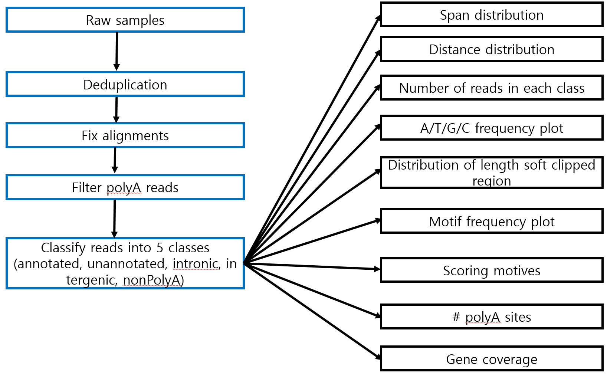
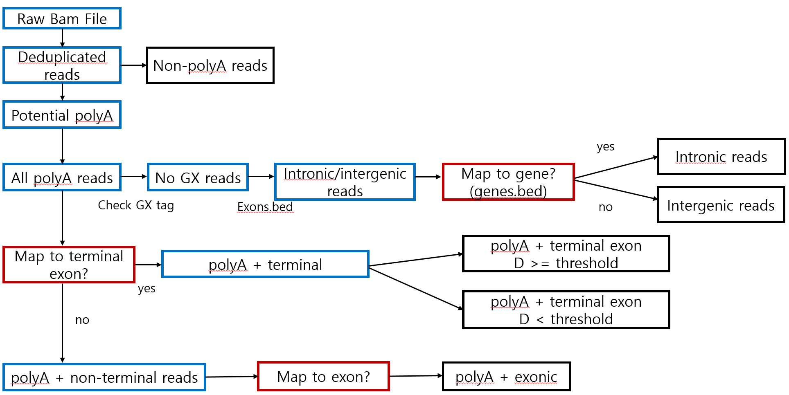

# SCINPAS (Single Cell Identification of Novel PolyA Sites)

## Description
SCINPAS is a nextflow pipeline that identifies previously known and noble polyA sites
directly from single 3'end RNA sequencing data.

## Workflow
  ### general workflow
  
  
  ### read classification into 5 categories
  

## Requirements


1) installation of nextflow and dependencies.

```bash
mamba create -n scinpas nextflow
```

2) Data must be single cell 3'end RNA sequencing data.
At the moment, the pipeline supports 10X genomics 3'end sequencing data.

3) Make sure all scripts (python, nextflow) are located in the "src" folder.

4) Make sure all mouse data (sample, negative controls, gtf and fasta) are located in "data/mouse" folder

5) Make sure all human data (sample, negative controls, gtf and fasta) are located in "data/human" folder

6) Make sure `canonical_motives.csv` are located in the "data" folder. (common to both human and mouse)

7) Input file format must be: 10X_A_B.bam.(and 10X_A.B.bam.bai), where A and B are sample name parts.

8) gtf file is named as: `genes.gtf`

9) reference genome is named as: `genome.fa` (and `genome.fa.fai`)

10) raw negative control must be structured as: *10X_A_BUmiRaw.bam (and *10X_A_BUmiRaw.bam.bai)
There should be at least 1 letter before 10X to differentiate between input file, by default "A" is used.

11) deduplicated negative control must be structured as: *10X_A_BUmiDedup.bam (and *10X_A_BUmiDedup.bam.bai)
There should be at least 1 letter before 10X to differentiate between input file, by default "A" is used.

raw negative control refers to the raw bam file of one of sample data. (same data but named differently).
deduplicated negative control refers to the UMI-tools deduplicated version of one of sample data. 

**Note: folder structures/locations, gtf file and reference genome can be changed in the nextflow.config file. 
However, input file format, gtf, fasta file and negative controls should not be changed because
downstream processes expect that name.**

## Command line

> Note: execution shown for slurm cluster. 
> Create and select other profile as fit.

If you want to run mouse samples:
`./nextflow run main.nf -profile slurm -resume --sample_type "mouse"`

If you want to run human samples:
`./nextflow run main.nf -profile slurm -resume --sample_type "human"`

For more nextflow commandline parameter options, refer to this website: https://www.nextflow.io/docs/latest
