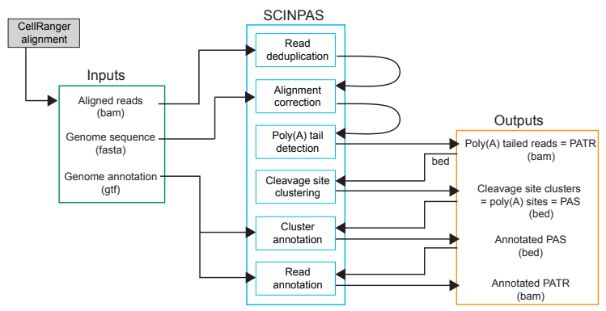
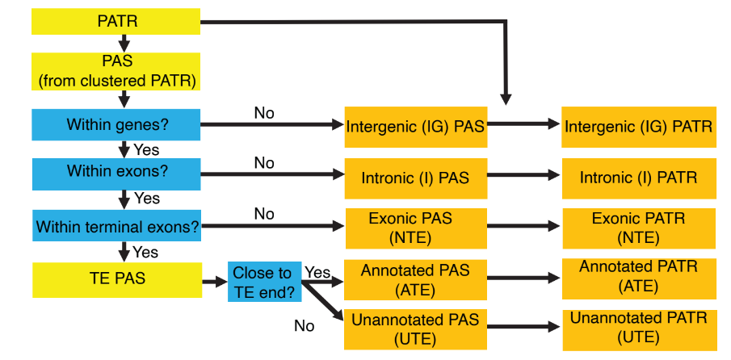
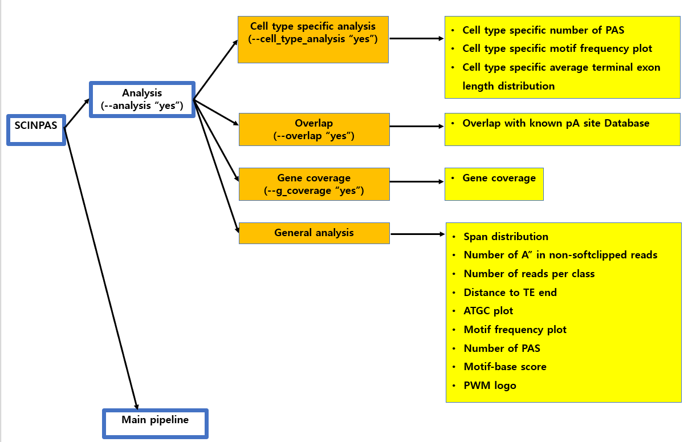
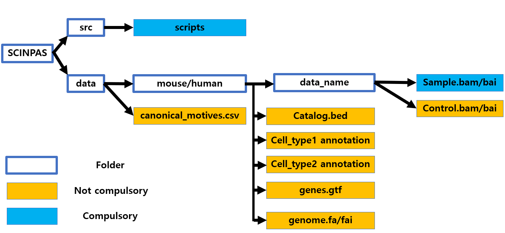

# SCINPAS (Single Cell Identification of Novel PolyA Sites)

## Description
SCINPAS is a nextflow pipeline that identifies previously known and noble polyA sites
directly from single 3'end RNA sequencing data.

## Workflow
  ### general workflow
  
  
  ### read classification into 5 categories
  

  ### analyses
  There are different layers of analyses. and hence you need to use the relevant parameters for running the pipeline.
  Please refer to this figure: 
  

	
## Requirements
0) default directory is set as follows


1) installation of nextflow and dependencies.

```bash
mamba create -n scinpas nextflow
```

2) Data must be single cell 3'end RNA sequencing data.
At the moment, the pipeline supports 10X genomics 3'end sequencing data.

3) Make sure all scripts (python, nextflow) are located in the "src" folder.

4) Make sure all mouse data (sample, negative controls, gtf and fasta) are located in "data/mouse" folder

5) Make sure all human data (sample, negative controls, gtf and fasta) are located in "data/human" folder

6) Make sure `canonical_motives.csv` are located in the "data" folder. (common to both human and mouse)

7) Input file format must be: 10X_A_B.bam.(and 10X_A.B.bam.bai), where A and B are sample name parts.

8) gtf file is named as: `genes.gtf`

9) reference genome is named as: `genome.fa` (and `genome.fa.fai`)

10) raw negative control must be structured as: *10X_A_BUmiRaw.bam (and *10X_A_BUmiRaw.bam.bai)
There should be at least 1 letter before 10X to differentiate between input file, by default "A" is used.

11) deduplicated negative control must be structured as: *10X_A_BUmiDedup.bam (and *10X_A_BUmiDedup.bam.bai)
There should be at least 1 letter before 10X to differentiate between input file, by default "A" is used.

raw negative control refers to the raw bam file of one of sample data. (same data but named differently).
deduplicated negative control refers to the UMI-tools deduplicated version of one of sample data. 

12) type1 and type2 parameter in nextflow.config file refers to cell type 1 and cell type 2 in the dataset you used.
Type1 is the default cell type. e.g. spermatocyte.
Type2 is cell type that you expect changes in average terminal exon length and/or the number of intronic polyA sites. e.g. elongating spermatid.
This is only relevant if you do "cell_type_analysis". 

**Note: folder structures/locations, gtf file, catalog, reference genome and result folder can be changed in the nextflow.config file. 
However, input file format and negative control format should not be changed because
downstream processes expect that name.**

## Command line

> Note: execution shown for slurm cluster. 
> Create and select other profile as fit.

1. Running mouse samples:

	1.1. if you do not want to run analysis:
	./nextflow run main.nf -profile slurm -resume --sample_type "mouse"

	1.2. if you want to do analysis but not (cell type specific and overlap analysis): 
	./nextflow run main.nf -profile slurm -resume --sample_type "mouse" --analysis "yes" 

	1.3. if you want to do analysis including cell type specific analysis: 
	./nextflow run main.nf -profile slurm -resume --sample_type "mouse" --analysis "yes"  --cell_type_analysis "yes"

	1.4. if you want to do analysis including analysis related to overlap (comparison between SCINPAS-induced PAS and pre-exsting catalog): 
	./nextflow run main.nf -profile slurm -resume --sample_type "mouse" --analysis "yes"  --overlap "yes"

	1.5. if you want to do all analysis: 
	./nextflow run main.nf -profile slurm -resume --sample_type "mouse" --analysis "yes" --cell_type_analysis "yes" --overlap "yes"

2. Running human samples:

	2.1. if you do not want to run analysis:
	./nextflow run main.nf -profile slurm -resume --sample_type "human"

	2.2. if you want to do analysis but not (cell type specific and overlap analysis): 
	./nextflow run main.nf -profile slurm -resume --sample_type "human" --analysis "yes" 

	2.3. if you want to do analysis including cell type specific analysis: 
	./nextflow run main.nf -profile slurm -resume --sample_type "human" --analysis "yes"  --cell_type_analysis "yes"

	2.4. if you want to do analysis including analysis related to overlap (comparison between SCINPAS-induced PAS and pre-exsting catalog): 
	./nextflow run main.nf -profile slurm -resume --sample_type "human" --analysis "yes"  --overlap "yes"

	2.5. if you want to do all analysis: 
	./nextflow run main.nf -profile slurm -resume --sample_type "human" --analysis "yes" --cell_type_analysis "yes" --overlap "yes"

3. background running of the pipeline:
	
	By default, nextflow displays progression report to the screen. If you do not want that,
	you can run "nohup" parameter so that progresison report is saved in the log file. Example command line is: 

	nohup ./nextflow run main.nf -profile slurm -resume --sample_type "mouse" --analysis "yes" --overlap "yes" 

4. Note:
	
	Running SCINPAS pipeline on the login node is not recommended despite it assign jobs to computing node.
	This is because nexflow displays progression report on the screen which can consume i/o extensively on the login node.
	Hence, it is recommended to login to computing node and run the pipeline there.

For more nextflow commandline parameter options, refer to this website: https://www.nextflow.io/docs/latest
