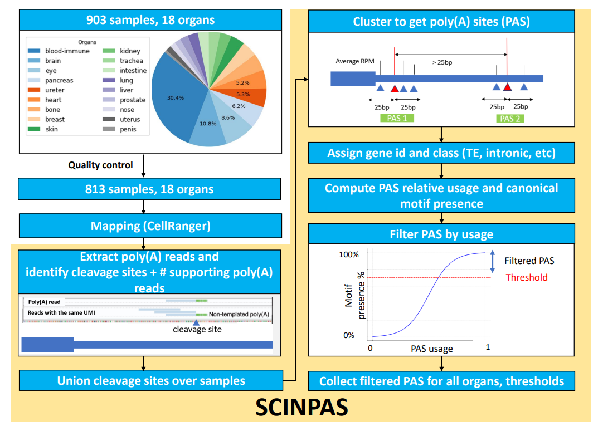
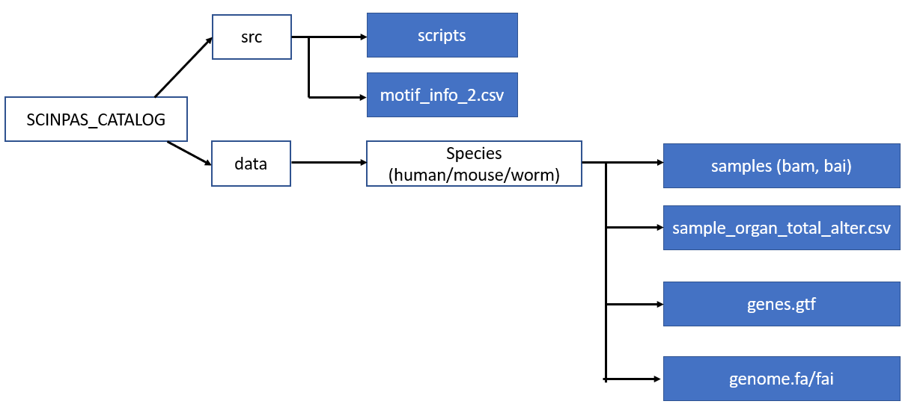
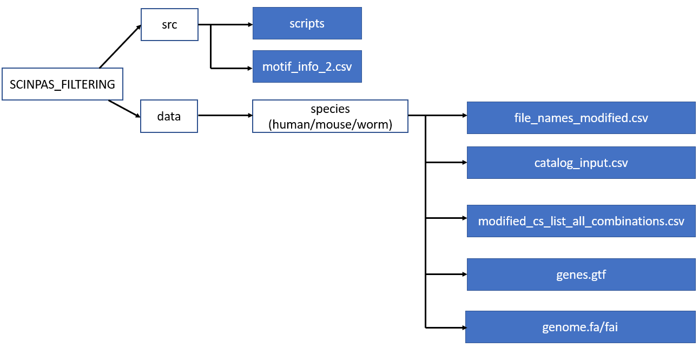

[](https://doi.org/10.5281/zenodo.8272892)
# SCINPAS (Single Cell Identification of Novel PolyA Sites)

## Description
SCINPAS is a nextflow pipeline that identifies previously known and novel polyA sites
directly from single cell RNA sequencing data.

## Workflow
  ### general workflow
  
  	
## Requirements

1) installation of nextflow and dependencies.

```bash
mamba create -n nf-env nextflow
```

2) Data must be single cell 3'end RNA sequencing data.
At the moment, the pipeline supports 10X genomics 3'end sequencing data.

3) Currently supported species are human, mouse and worm

4) Default directory of SCINPAS is set as follows


	Set-up guideline for SCINPAS_CATALOG:

	4-1) Make sure all scripts (python, nextflow) are located in the "src" folder.

	4-2) Make sure motif_info_2.csv is located in "src" folder

	4-3) Make sure all data (bam/bai, sample_organ_total_alter.csv, gtf and fasta) are located in "data" folder

	4-4) sample_organ_total_alter.csv contains 3 columns "dir" "sample" and "organ" where "dir" contains the full directory towards sample
	and (e.g. /scicore/home/zavolan/moon0000/CATALOG_CLEAN/data/human/bloodImmune) and "sample" being SCINPAS sample name (e.g. 10X_190_1). 

	4-5) "sample" column in sample_organ_total_alter.csv must be: 10X_A_B.bam.(and 10X_A.B.bam.bai), where A and B are sample name parts.

	4-6) gtf file is named as: `genes.gtf`

	4-7) reference genome is named as: `genome.fa` (and `genome.fa.fai`)

5) Default directory of SCINPAS_FILTERING is set as follows


	Set-up guideline for SCINPAS_FILTERING:

	5-1) Make sure all scripts (python, nextflow) are located in the "src" folder.

	5-2) Make sure motif_info_2.csv is located in "src" folder

	5-3) Make sure (file_names_modified.csv, catalog_input.csv, modified_cs_list_all_combinations.csv, gtf and fasta)
	are in "data" folder.

	5-4) file_names_modified.csv contains 4 columns: "filename", "chromosome", "direction", "organ" where "filename" contains
	full directory towards individiual sample cleavage sites.bed (e.g. /scicore/home/zavolan/moon0000/CATALOG/result/human/v1.0.2/all_organs_split_bed_clustering/10X_131_1-brain_all_polyA_cs_sampleForOrganGrouping_21_+.bed)

	5-5) catalog_input.csv contains 3 columns: "chrom", "direction", "path" where "path" contains
	full directory towards PAS clusters of all samples. (e.g. /scicore/home/zavolan/moon0000/CATALOG/result/human/v1.0.2/all_organs_merged_bed_clustering/Allsamples_polyA_cluster_out_Y_+.bed)

	5-6) modified_cs_list_all_combinations.csv contains 1 column: "sample" which contains
	full directory towards cleavage sites of all samples that have PAS cluster id assigned.
	(e.g. /scicore/home/zavolan/moon0000/CATALOG/result/human/v1.0.2/all_organs_merged_bed_clustering/all_samples_modified_unique_cs_22_-.bed)

	5-7) gtf file is named as: `genes.gtf`

	5-8) reference genome is named as: `genome.fa` (and `genome.fa.fai`)

**Note: For future users, SCINPAS_FILTERING will be integrated into the main SCINPAS_CATALOG and hence no need to prepare individual csv files in the future (file_names_modified.csv, catalog_input.csv, modified_cs_list_all_combinations.csv).**

## Command line

> Note: execution shown for slurm cluster. 
> Create and select other profile as fit.

Once you made a conda environment and activated the environment (conda activate nf-env), traverse into src folder and run the nextflow command as follows:

1. Running SCINPAS to create CATALOG (SCINPAS_CATALOG):

	The workflow has 2 folds. You need to run the workflow twice.

	1.1. 1st workflow occurrence command (to enable manual filtering of samples by % uniquely mapped reads and sequence quality threshold):
	
		nohup nextflow run main.nf -profile slurm -resume --sample_type "human" --check "yes"
	
		From this 1st workflow: 
		- check whether % uniquely mapped reads are high enough and do 1st filtering of samples with low %
		  This generates output "sample_organ_first_filtered.csv"
		- check sequence quality is high enough to do 2nd filtering of samples with low sequence quality
			This generates output "sample_organ_second_filtered.csv"
	
	1.2. 2nd workflow occurrence command (to run the whole workflow and generate catalog):

		nohup nextflow run main.nf -profile slurm -resume --sample_type "human" --check "no"
		
		This uses "sample_organ_second_filtered.csv" from the 1st workflow (do not change the output name of this) as an input
		run the following command, if you think manual filtering from the 1st workflow makes sense

		You can replace human with mouse or worm. For now only supports 3 species. 

2. RUNNING SCINPAS_FILTERING (Separating PAS from noise)

	nohup nextflow run main.nf -profile slurm -resume --sample_type "human"

	You can replace human with mouse or worm. For now only supports 3 species. 

2. background running of the pipeline:
	
	By default, nextflow displays progression report to the screen. If you do not want that,
	you can run "nohup" parameter so that progresison report is saved in the log file. Example command line is: 

	nohup nextflow run main.nf -profile slurm -resume --sample_type "mouse" --analysis "yes" --cell_type_analysis "yes" --overlap "yes" --g_coverage "yes"

3. Note:
	
	Running SCINPAS pipeline on the login node is not recommended despite it assign jobs to computing node.
	This is because nexflow displays progression report on the screen which can consume i/o extensively on the login node.
	Hence, it is recommended to login to computing node and run the pipeline there.

For more nextflow command line parameter options, refer to this website: https://www.nextflow.io/docs/latest
